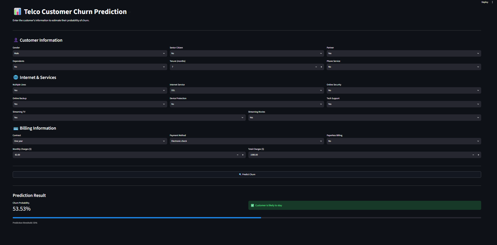

# 📊 Telco Customer Churn Prediction

A machine learning web application that predicts whether a telecom
customer is likely to churn based on customer, service, contract, and
billing information.

Built with **Python, Scikit-learn, Pandas, and Streamlit**.

------------------------------------------------------------------------

## 🖥️ UI Preview



The application provides a simple interface where users can enter
customer details and receive:

-   Churn probability
-   Churn / stay prediction
-   Prediction threshold information

------------------------------------------------------------------------

## 🎯 Project Objective

Customer churn is an important business problem for telecom companies.

The goal of this project is to predict whether a customer is likely to
leave the service so that the company can identify high-risk customers
and potentially take retention actions.

------------------------------------------------------------------------

## 📂 Dataset

This project uses the **IBM Telco Customer Churn** dataset.

-   **Rows:** 7,043
-   **Original columns:** 21
-   **Target:** `Churn`
-   `0` → Customer stayed
-   `1` → Customer churned

Dataset source:

https://www.kaggle.com/datasets/blastchar/telco-customer-churn

------------------------------------------------------------------------

## 🔧 Data Preprocessing

The dataset was prepared using the following steps:

1.  Removed `customerID` because it is an identifier rather than a
    useful predictive feature.
2.  Converted binary categorical variables into numerical values.
3.  Converted `TotalCharges` to numeric values.
4.  Handled missing values in `TotalCharges`.
5.  Applied One-Hot Encoding to:
    -   `MultipleLines`
    -   `InternetService`
    -   `Contract`
    -   `PaymentMethod`
6.  Split the data into training and testing sets.
7.  Standardized numerical features for Logistic Regression.

The final model uses **28 input features**.

------------------------------------------------------------------------

## 🤖 Models Tested

Several classification algorithms were evaluated:

-   Logistic Regression
-   K-Nearest Neighbors
-   Decision Tree
-   Random Forest
-   Gradient Boosting
-   XGBoost
-   CatBoost
-   Support Vector Machine
-   LightGBM

The models were compared using:

-   Accuracy
-   ROC-AUC
-   Precision
-   Recall
-   F1-score

Because the dataset is imbalanced, particular attention was given to
**Class 1 (churn)** performance.

------------------------------------------------------------------------

## 🏆 Final Model

The selected model is a:

**Balanced Logistic Regression**

The model uses:

-   `class_weight="balanced"`
-   Optuna hyperparameter tuning
-   Best `C` ≈ **0.7356**
-   Prediction threshold = **0.55**

### Final Test Performance

  Metric                     Score
  ------------------- ------------
  Accuracy              **77.79%**
  ROC-AUC               **86.20%**
  Class 1 Precision     **55.64%**
  Class 1 Recall        **79.36%**
  Class 1 F1-score      **65.41%**

### Confusion Matrix

``` text
[[800 236]
 [ 77 296]]
```

This means:

-   **800** customers were correctly predicted to stay.
-   **236** customers were predicted to churn but actually stayed.
-   **77** customers who actually churned were missed.
-   **296** customers were correctly identified as churners.

The model therefore identifies approximately **79% of actual churners**.

------------------------------------------------------------------------

## ⚖️ Handling Class Imbalance

The target variable is imbalanced because there are substantially more
customers who stayed than customers who churned.

To address this, the final Logistic Regression model uses:

``` python
class_weight="balanced"
```

This gives greater importance to the minority class during training.

A prediction threshold of **0.55** was also selected to balance
precision and recall for churn prediction.

------------------------------------------------------------------------

## 🔍 Why Logistic Regression?

Although some models achieved higher raw accuracy, Logistic Regression
provided a strong combination of:

-   High ROC-AUC
-   High recall for churners
-   Competitive Class 1 F1-score
-   Interpretability
-   Fast prediction
-   Simple deployment

For a churn problem, identifying customers who are actually likely to
leave is more important than optimizing accuracy alone.

------------------------------------------------------------------------

## 🧠 Hyperparameter Tuning

Optuna was used to tune the Logistic Regression `C` parameter.

Search space:

``` python
C = trial.suggest_float("C", 0.001, 10, log=True)
```

The best value found was approximately:

``` text
C = 0.7356
```

Cross-validation was used during tuning, while the test set was kept for
final evaluation.

------------------------------------------------------------------------

## 🌐 Streamlit Application

The trained model is saved as:

``` text
telco_churn_model.pkl
```

The Streamlit application loads this model and performs predictions on
new customer information.

Project structure:

``` text
customer-churn/
│
├── app.py
├── telco_churn_model.pkl
├── requirements.txt
└── ui_screenshot.png
```

------------------------------------------------------------------------

## 🚀 Run Locally

### 1. Install dependencies

``` bash
pip install -r requirements.txt
```

### 2. Start Streamlit

``` bash
streamlit run app.py
```

The application will open in your browser.

------------------------------------------------------------------------

## 📦 Requirements

``` text
streamlit
pandas
scikit-learn
joblib
```

------------------------------------------------------------------------

## 🛠️ Tech Stack

-   **Python**
-   **Pandas**
-   **NumPy**
-   **Scikit-learn**
-   **XGBoost**
-   **LightGBM**
-   **CatBoost**
-   **Optuna**
-   **Streamlit**
-   **Joblib**

------------------------------------------------------------------------

## 📌 Future Improvements

Possible improvements include:

-   Add feature importance / coefficient visualization
-   Add probability-based risk categories
-   Add customer retention recommendations
-   Improve UI styling
-   Add model monitoring
-   Deploy the application publicly
-   Package preprocessing and model into a single production pipeline

------------------------------------------------------------------------

## 👨‍💻 Project Summary

This project demonstrates an end-to-end machine learning workflow:

``` text
Data
 ↓
Cleaning
 ↓
Encoding
 ↓
Train/Test Split
 ↓
Multiple ML Models
 ↓
Imbalance Handling
 ↓
Model Comparison
 ↓
Optuna Tuning
 ↓
Threshold Tuning
 ↓
Final Evaluation
 ↓
Streamlit Deployment
```
